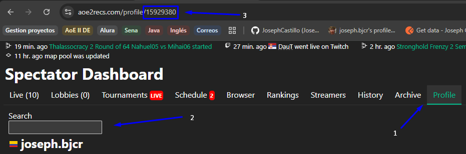
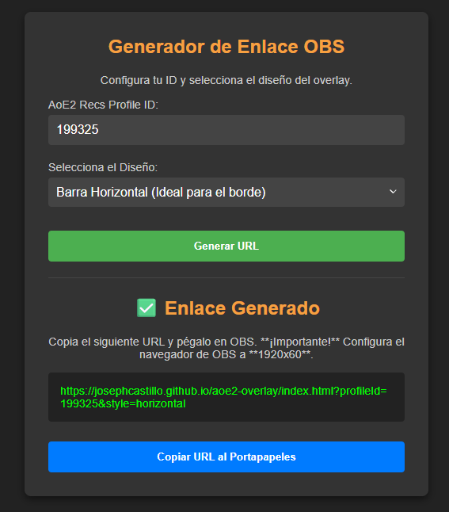
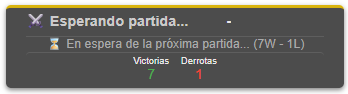
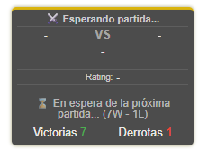
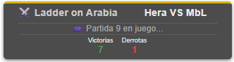
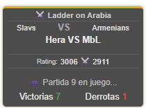

# 🏆 AoE2 DE — Overlay de Racha para OBS

> Overlay gratuito para mostrar en vivo la **racha de partidas** (victorias/derrotas) de un jugador de **Age of Empires II: Definitive Edition**.  
> Ideal para **streamers** que quieran enseñar su rendimiento en tiempo real sin complicaciones.

---

## 🔎 ¿Qué hace este proyecto?

Este overlay permite mostrar información **en tiempo real** de un jugador de Age of Empires II DE directamente en tu stream (OBS).  
Muestra datos como:

- ✅ Número de **victorias** y ❌ **derrotas** en la racha actual.  
- 🎮 Estado del jugador (**en partida** o **en espera**).  
- 🗺️ **Mapa** actual de la partida.  
- 👤 **Nombres de los jugadores** que están compitiendo.

---

## 🚀 Guía rápida — paso a paso

### 1️⃣ Obtén tu `profile_id`

1. Abre tu perfil en [AoE2 Recs](https://aoe2recs.com).  
2. Fíjate en la URL de tu perfil, por ejemplo: [Ir perfil](https://aoe2recs.com/profile/15929380)

Tu **profile_id** es el número final (`15929380` en este ejemplo).

📸 Ejemplo visual:

---

### 2️⃣ Abre el generador de enlace

Haz clic aquí 👉 [**Generador de Overlay**](https://josephcastillo.github.io/aoe2-overlay/config.html)

---

### 3️⃣ Configura tu overlay

En el formulario del generador:

1. Escribe tu **AoE2 Recs Profile ID** (el número que copiaste antes).  
2. Selecciona el diseño del overlay:
- 🟩 **Barra Horizontal** → ideal para poner arriba o abajo del stream.  
- 🟦 **Vertical** → ideal para un lateral del stream.
3. Haz clic en **“Generar URL”**.

📸 Ejemplo del generador:

---

### 4️⃣ Copia la URL generada

El generador te mostrará una URL similar a esta:

"https://josephcastillo.github.io/aoe2-overlay/?id=15929380&design=horizontal"

Cópiala, la usarás en OBS.

---

### 5️⃣ Agrégala en OBS

1. Abre OBS y ve a tu escena.  
2. Añade una nueva fuente → **Navegador**.  
3. En el campo **URL**, pega la dirección que generaste.  
4. Configura el tamaño según el diseño:

| Diseño        | Tamaño recomendado |
|----------------|--------------------|
| Barra Horizontal | `1920 x 60` |
| Vertical         | `300 x 1080` |

5. Opcional: activa el fondo transparente si quieres integrar el overlay con tu diseño.

✅ ¡Listo! Tu overlay mostrará tu racha y estado **en tiempo real**.

---

## 🖼️ Ejemplos visuales

**Esperando partida:**  

**En partida activa:**  

---

## ⚙️ Opciones y tamaños recomendados

- **Horizontal (ideal para bordes):**
  - Tamaño OBS: `1920x60`
  - Colócalo en la parte superior o inferior del stream.

- **Vertical (ideal para laterales):**
  - Tamaño OBS: `300x1080`
  - Perfecto para mostrar en un costado del stream.

---

## ❗ Notas importantes

- El overlay **solo funciona** con tu **profile_id** principal. (No admite smurfs).  
- Actualmente muestra **solo partidas 1v1 clasificadas**.  
- Si el ID es incorrecto, el overlay no cargará información.  
- Los datos se actualizan en tiempo real directamente desde **AoE2 Recs**.

---

## 🧩 Ejemplo de uso completo

**URL generada:**
"https://josephcastillo.github.io/aoe2-overlay/?id=15929380&design=horizontal"

**En OBS:**
- Fuente → Navegador  
- URL → pega la anterior  
- Tamaño → `1920x60`  
- Fondo → transparente (opcional)  

El overlay mostrará tu información de forma automática durante tus partidas.

---

## 🛠️ Solución de problemas

| Problema | Posible causa | Solución |
|-----------|----------------|-----------|
| ❌ No se ve nada | ID incorrecto o vacío | Verifica que la URL contenga `?id=` y tu número |
| ⚫ Fondo oscuro | Fondo no transparente | Activa la opción de transparencia en la fuente navegador |
| 🔄 No se actualiza | Problemas temporales con AoE2 Recs | Espera unos minutos o recarga la fuente |
| ⚠️ Perfil no encontrado | ID inválido | Revisa tu número desde [aoe2recs.com](https://aoe2recs.com) |

---

## ❤️ Hecho para la comunidad

Este proyecto fue creado para que cualquier jugador o streamer de **Age of Empires II: DE** pueda mostrar su desempeño en tiempo real sin instalar nada.  
Solo genera tu enlace una vez y úsalo libremente.

---

## 👥 Contribuir / Reportar errores

Si deseas:
- Mejorar el diseño,
- Añadir soporte para partidas en equipo,
- Traducir a otros idiomas,
- O reportar errores,

puedes abrir un *issue* o *pull request* en el repositorio del proyecto.

---

## 📝 Créditos y licencia

- 💡 Creado por [Joseph Castillo](https://github.com/josephcastillo)  
- 🏰 Inspirado por la comunidad de **Age of Empires II: DE**  
- 📄 Licencia: MIT (libre uso con atribución)

---

## ☕ Apoya el proyecto

Si este overlay te resultó útil y quieres apoyar su desarrollo 💖  
puedes invitarme un café o hacer una pequeña donación vía **PayPal**:

👉 [**Donar vía PayPal**](https://paypal.me/josephcr09)

Cada aporte ayuda a mantener y mejorar el proyecto para la comunidad.  
¡Gracias por tu apoyo! 🙌

---

> “La gloria no está en ganar siempre, sino en mejorar cada partida.” ⚔️
